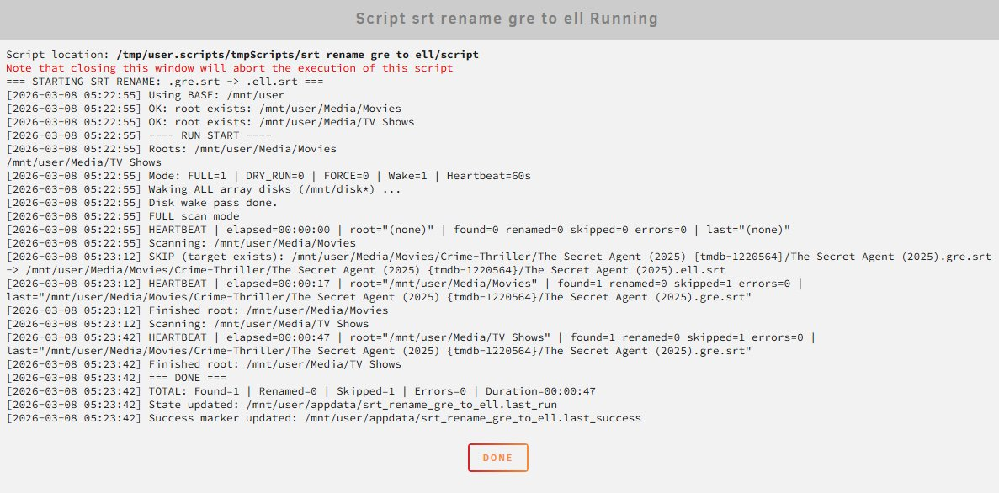

# Unraid srt lang rename

Batch-rename subtitle files to correct ISO 639 language codes on Unraid (gre → ell, and more)

```
Movie.2020.gre.srt  →  Movie.2020.ell.srt
```

Most modern media servers (Jellyfin, Plex, Kodi) now expect `ell` and may fail to detect Greek subtitles tagged with the deprecated `gre` code.

---

## Features

- 🔍 **Full & incremental scan** — scan everything or only files changed since last run
- 🧪 **Dry-run mode** — preview renames before committing
- 💤 **Low resource usage** — runs at reduced CPU and I/O priority (`renice`/`ionice`)
- 📋 **Detailed logging** — to file and Unraid syslog, with periodic heartbeat progress
- 🔁 **Log rotation** — automatically trims the log file to a configurable line limit
- 🛡️ **Safe defaults** — skips existing destinations, skips `.Recycle.Bin`, only updates state on clean runs

---

## Requirements

- Unraid 7.2.x or later
- [User Scripts](https://forums.unraid.net/topic/48286-plugin-user-scripts/) plugin (available via Community Applications)

---

## Installation

1. Open **Settings → User Scripts → Add New Script**
2. Give it a name (e.g. `srt rename gre to ell`)
3. Click the gear icon → **Edit Script**
4. Download [`srt_rename_gre_to_ell.sh`](./srt_rename_gre_to_ell.sh) and paste its contents
5. Edit the **User Configuration** block at the top to match your setup
6. Save

---

## Configuration

All user-facing settings are grouped in a clearly marked block near the top of the script:

```bash
# ============================================================
# USER CONFIGURATION — edit these to match your setup
# ============================================================

BASE="/mnt/user"
[[ -d "/mnt/user0/Media" ]] && BASE="/mnt/user0"

ROOTS=(
  "$BASE/Media/Movies"
  "$BASE/Media/TV Shows"
)

LOG="/mnt/user/appdata/srt_rename_gre_to_ell.log"
STATE="/mnt/user/appdata/srt_rename_gre_to_ell.last_run"
SUCCESS_MARK="/mnt/user/appdata/srt_rename_gre_to_ell.last_success"

LOG_MAX_LINES=5000
HEARTBEAT_SECS=60
```

### Variable reference

| Variable | Default | Description |
|---|---|---|
| `BASE` | `/mnt/user` (auto-detected) | Root of your Unraid array. Auto-switches to `/mnt/user0` if present. Override manually if needed. |
| `ROOTS` | `Movies`, `TV Shows` | Array of media folders to scan. Add or remove paths to match your library. |
| `LOG` | `/mnt/user/appdata/srt_rename_gre_to_ell.log` | Path to the log file. |
| `STATE` | `/mnt/user/appdata/srt_rename_gre_to_ell.last_run` | Timestamp file used by incremental mode. |
| `SUCCESS_MARK` | `/mnt/user/appdata/srt_rename_gre_to_ell.last_success` | Marker file updated only on clean (zero-error) runs. |
| `LOG_MAX_LINES` | `5000` | Log file is trimmed to this many lines at the start of each run. |
| `HEARTBEAT_SECS` | `60` | How often (seconds) a progress line is written to the log during long scans. |

---

## Usage

### Script Arguments (User Scripts UI)

Set these in the **Script Arguments** field, or append them when calling the script manually:

| Flag | Description |
|---|---|
| `--dry-run` | Preview only — no files are renamed. **Always run this first.** |
| `--force` | Rename even if a `.ell.srt` already exists at the destination. |
| `--full` | Full scan mode (default). |
| `--inc` | Incremental mode — only scan files newer than the last successful run. |
| `--wake` | Wake all array disks before scanning (default: enabled). |

### Recommended first run

Set **Script Arguments** to `--dry-run`, run the script, then check the log:

```bash
tail -f /mnt/user/appdata/srt_rename_gre_to_ell.log
```

If the output looks correct, remove `--dry-run` and run again.

---

## Output



## Notes

- The script **skips `.Recycle.Bin`** folders automatically
- If a `.ell.srt` already exists at the destination, the file is **skipped** (use `--force` to override)
- The `STATE` and `SUCCESS_MARK` files are only updated if the run completes with **zero errors**
- Logs are written to both the log file and Unraid's syslog (`logger -t srt-rename`)
- The script can be adapted for other language code migrations (e.g. `iw` → `he`, `heb` → `he`)

---

## Script

```bash
#!/bin/bash
set -euo pipefail
IFS=$'\n\t'

renice -n 15 -p $$ >/dev/null 2>&1 || true
ionice -c2 -n7 -p $$ >/dev/null 2>&1 || true

echo "=== STARTING SRT RENAME: .gre.srt -> .ell.srt ==="

# ============================================================
# USER CONFIGURATION — edit these to match your setup
# ============================================================

BASE="/mnt/user"
[[ -d "/mnt/user0/Media" ]] && BASE="/mnt/user0"

ROOTS=(
  "$BASE/Media/Movies"
  "$BASE/Media/TV Shows"
)

LOG="/mnt/user/appdata/srt_rename_gre_to_ell.log"
STATE="/mnt/user/appdata/srt_rename_gre_to_ell.last_run"
SUCCESS_MARK="/mnt/user/appdata/srt_rename_gre_to_ell.last_success"

LOG_MAX_LINES=5000
HEARTBEAT_SECS=60

# ============================================================
# END OF USER CONFIGURATION
# ============================================================

DRY_RUN=0
FORCE=0
FULL=1
WAKE_DISKS=1

while [[ $# -gt 0 ]]; do
  arg="${1//$'\r'/}"
  case "$arg" in
    "") shift ;;
    --dry-run) DRY_RUN=1; shift ;;
    --force)   FORCE=1; shift ;;
    --full)    FULL=1; shift ;;
    --inc)     FULL=0; shift ;;
    --wake)    WAKE_DISKS=1; shift ;;
    *) echo "Unknown option: [$(printf '%q' "$arg")]"; exit 1 ;;
  esac
done

mkdir -p "$(dirname "$LOG")"

if [[ -f "$LOG" ]]; then
  tmp_log="$(mktemp)"
  tail -n "$LOG_MAX_LINES" "$LOG" > "$tmp_log" && mv "$tmp_log" "$LOG"
fi

fmt_secs() {
  local s="$1"
  printf "%02d:%02d:%02d" $((s/3600)) $(((s%3600)/60)) $((s%60))
}

log() {
  local msg="$1"
  local ts
  ts="$(date '+%F %T')"
  echo "[$ts] $msg" | tee -a "$LOG"
  logger -t srt-rename "$msg" 2>/dev/null || true
}

missing=0
log "Using BASE: $BASE"
for r in "${ROOTS[@]}"; do
  if [[ ! -d "$r" ]]; then
    log "ERROR: root not found: $r"
    missing=1
  else
    log "OK: root exists: $r"
  fi
done
if [[ $missing -eq 1 ]]; then
  log "ABORT: Fix ROOTS and rerun."
  exit 1
fi

START_TS="$(date +%s)"
CURRENT_ROOT="(none)"
LAST_FILE="(none)"
LAST_BEAT_TS="$START_TS"

found=0 renamed=0 skipped=0 errors=0

beat() {
  local now elapsed
  now="$(date +%s)"
  elapsed=$((now - START_TS))
  log "HEARTBEAT | elapsed=$(fmt_secs "$elapsed") | root=\"$CURRENT_ROOT\" | found=$found renamed=$renamed skipped=$skipped errors=$errors | last=\"$LAST_FILE\""
  LAST_BEAT_TS="$now"
}

wake_all_disks() {
  log "Waking ALL array disks (/mnt/disk*) ..."
  shopt -s nullglob
  for d in /mnt/disk*; do
    [[ -d "$d" ]] || continue
    ls -1 "$d" >/dev/null 2>&1 || true
  done
  shopt -u nullglob
  log "Disk wake pass done."
}

process_one() {
  local file="$1"
  found=$(( found + 1 ))
  LAST_FILE="$file"

  local new_file
  new_file="$(printf '%s' "$file" | sed -E 's/\.gre\.srt$/.ell.srt/')"

  if [[ "$new_file" == "$file" ]]; then
    skipped=$(( skipped + 1 ))
    return
  fi

  if [[ -e "$new_file" && $FORCE -eq 0 ]]; then
    skipped=$(( skipped + 1 ))
    log "SKIP (target exists): $file -> $new_file"
    return
  fi

  if [[ $DRY_RUN -eq 1 ]]; then
    renamed=$(( renamed + 1 ))
    log "[DRY-RUN] Would rename: $file -> $new_file"
    return
  fi

  if mv -- "$file" "$new_file"; then
    renamed=$(( renamed + 1 ))
    log "Renamed: $file -> $new_file"
  else
    errors=$(( errors + 1 ))
    log "ERROR renaming: $file"
  fi
}

log "---- RUN START ----"
log "Roots: ${ROOTS[*]}"
log "Mode: FULL=$FULL | DRY_RUN=$DRY_RUN | FORCE=$FORCE | Wake=$WAKE_DISKS | Heartbeat=${HEARTBEAT_SECS}s"

if [[ $WAKE_DISKS -eq 1 ]]; then
  wake_all_disks
fi

if [[ $FULL -eq 0 ]]; then
  if [[ -f "$STATE" ]]; then
    log "Incremental since: $(date -r "$STATE")"
  else
    log "Incremental since: (none) -> first run will behave like full for matches"
  fi
else
  log "FULL scan mode"
fi

beat

for root in "${ROOTS[@]}"; do
  CURRENT_ROOT="$root"
  log "Scanning: $root"

  if [[ $FULL -eq 0 && -f "$STATE" ]]; then
    while IFS= read -r -d '' file; do
      now="$(date +%s)"
      if (( now - LAST_BEAT_TS >= HEARTBEAT_SECS )); then
        beat
      fi
      process_one "$file"
    done < <(find "$root" \( -type d -name ".Recycle.Bin" -prune \) -o \
      \( -type f -iname "*.gre.srt" -newer "$STATE" -print0 \))
  else
    while IFS= read -r -d '' file; do
      now="$(date +%s)"
      if (( now - LAST_BEAT_TS >= HEARTBEAT_SECS )); then
        beat
      fi
      process_one "$file"
    done < <(find "$root" \( -type d -name ".Recycle.Bin" -prune \) -o \
      \( -type f -iname "*.gre.srt" -print0 \))
  fi

  beat
  log "Finished root: $root"
done

END_TS="$(date +%s)"
TOTAL_SECS=$((END_TS - START_TS))

log "=== DONE ==="
log "TOTAL: Found=$found | Renamed=$renamed | Skipped=$skipped | Errors=$errors | Duration=$(fmt_secs "$TOTAL_SECS")"

if [[ $DRY_RUN -eq 0 && $errors -eq 0 ]]; then
  touch "$STATE"
  touch "$SUCCESS_MARK"
  log "State updated: $STATE"
  log "Success marker updated: $SUCCESS_MARK"
else
  log "State NOT updated (dry-run or errors present)"
fi

exit 0
```

---

## License

This project is licensed under the **MIT License** — you are free to use, copy, modify, merge, publish, distribute, and sublicense this software for any purpose, with or without modification, as long as the original copyright notice is retained.

See the [LICENSE](./LICENSE) file for the full license text.
